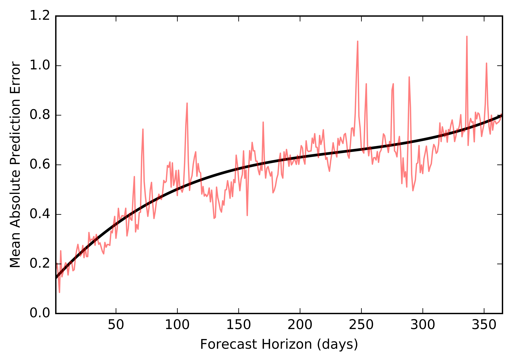
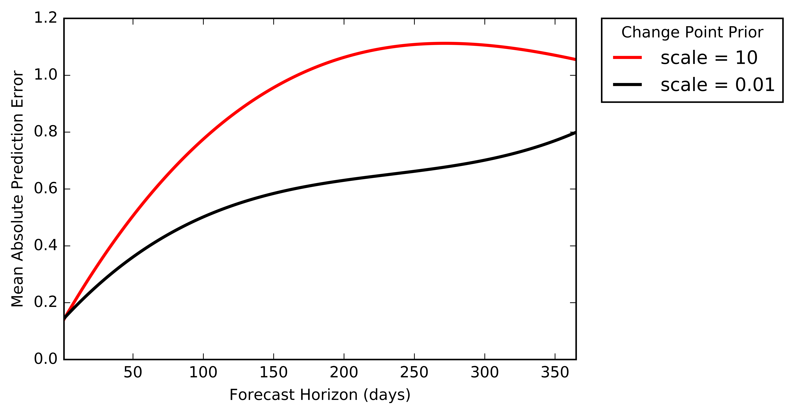

# Time Series Analysis with a Generaized Additive Model

To study page view trends for a Wikipedia article on Daylight Saving Time, we first used a [Python script to extract the data from a Wikipedia database](https://github.com/algobeans/Time-Series-Forecasting/blob/master/scrapWiki.py). Next, we used a GAM package called *Prophet* published by Facebook researchers to conduct our [time series analysis in Python](https://github.com/algobeans/Time-Series-Forecasting/blob/master/Time%20Series%20Analysis.ipynb). The package is also available in R.

Accompanying tutorial here: https://algobeans.com/2017/04/04/laymans-tutorial-time-series-analysis/

Overall, annual, weekly and holiday trends:

Validating the model with simulated historical forecasts:

Examining error rates:

Comparing error rates across models to check effects of parameters:

References:
- Wikipedia page views data: http://stats.grok.se/
- Facebook *Prophet* package: https://facebookincubator.github.io/prophet/
